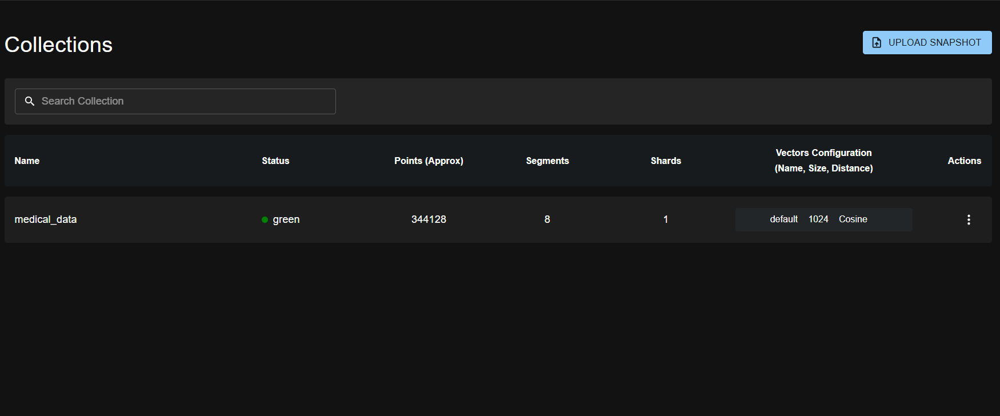

# 🏥 Medical-Chatbot 

A **Retrieval-Augmented Generation (RAG) chatbot** built using **FastAPI** for the backend and **Streamlit** for the frontend, enabling users to interact with **large language models (LLMs)** via the **GROQ API**. The system is optimized for **fast response times** and supports **question-answering** over a **vector database** containing medical knowledge.

It utilizes the **LLaMA-4 model**, known for its strong **multilingual capabilities**, making it well-suited for handling **in-depth, domain-specific queries**.

📚 The medical knowledge base is constructed by **crawling data from trusted Vietnamese healthcare sources**, including **Vinmec**, **Nhà thuốc Long Châu**, and others. This allows the chatbot to provide **reliable and localized answers** in the medical domain.

**Disclaimer**: `Medical-Chatbot` is provided for demonstration purposes only. It is configured to run on CPU to ensure compatibility with most hardware. However, you can enable GPU support by following the instructions in: [utils.py](rag_pipeline\src\utils.py). Additionally, the response length is limited to a fixed number of tokens, but you can fully customize this parameter in: [model_setup.py](rag_pipeline\src\model_setup.py)

**Architecture** of the platform is as follows:   
 

The MLOps system illustrated in the diagram operates through two separate pipelines:
- **For developers**, the workflow begins by pushing the source code to a version control system (Step 1), which then triggers a local CI/CD pipeline (Step 2). This pipeline builds, tests, and deploys containers using Docker Compose. Once testing is complete, the entire project (including source code and Docker Compose files) is deployed to a virtual machine (VM) on Google Cloud (Step 3). Within this VM, a Large Language Model (LLM) is also accessed via the GROQ API to serve inference requests (Step 4).
- **For users**, the interaction starts by sending a query (**Step 1**), which is routed through an **API gateway** (**Step 2**). The system then forwards the query to the **backend service** (**Step 3**), retrieves relevant vectors from **Qdrant** — a high-performance vector database (**Step 4**), and uses the **conversation history** stored in **PostgreSQL** (filtered by the current `sessionID`) to provide coherent and context-aware responses (**Step 4.5**). Finally, the **API gateway** delivers the result to the user via a **Streamlit UI interface** (**Step 5**).

Monitoring services are configured by the developer using `Jaeger`, `Prometheus`, and `Grafana`, enabling real-time tracking of system performance and status.

## 📌 Features
✅ **FastAPI backend** for handling local LLM inference and document retrieval.                                                                                                      
✅ **Streamlit frontend** for a lightweight and interactive chat experience.                                               
✅ **RAG support** to enhance the personalized chat experience.                                                    
✅ **Automatic deployment** using Docker and Jenkins.             
✅ **GROQ API** for extremely fast LLM inference via external API calls.                                                       
✅ **Monitoring services** with dashboards that measure system performance (e.g., request, latency, CPU usage) using Prometheus, Grafana, and Jaeger tracing.                           
✅ **CI/CD pipeline** for automatic testing and container building with Jenkins.                                          
✅ **Cloud support** for hosting the LLM on Google Cloud Platform via Google Cloud VM.                               

---

## 📂 Project Structure
```
MEDICAL-CHABOT/  
│── docker-compose.yaml       # Docker setup for backend & frontend  
│── Jenkinsfile               # Jenkinsfile for CI/CD pipeline
├─ rag-pipeline/              # Backend (FastAPI)  
│ ├─── notebooks/             # Notebooks for chunking and embedding process 
│ ├─── src/                   # Source code    
│ ├─── test/                  # Test Retrieval
│ ├─── Dockerfile             # Backend Docker configuration  
│ ├─── requirements.txt       # Backend dependencies  
│
├─ streamlit/                 # Frontend (Streamlit)  
│ ├─── main.py                # Streamlit UI logic  
│ ├─── requirements.txt       # Frontend dependencies  
│ ├─── Dockerfile             # Frontend Docker configuration  
│  
├─ nginx/                     # API gateway configuration
│
├─ .env.docker                # Environment variables for Docker setup
│
├─ crawl_data/                # Crawl data file
│
├─ example.env                # Example environment variables with GROQ API
│
├─ grafana/                   # Monitoring service (Grafana)  
│
├─ prometheus/                # Scraping metrics from backend (Prometheus)  
│
├─ jenkins/                   # CI/CD pipeline using Jenkins
│  
└── README.md                 # Project Documentation  

```

## 📦 Project Dependencies
- Docker desktop 
- Docker Compose 

## 📖 Table of Contents
- [1. Setup GROQ API](#1-setup-groq-api)
  - [Create a GROQ Account](#create-a-groq-account)
  - [Get Your API Key](#get-your-api-key)
  - [Set Up Environment Variables](#set-up-environment-variables)
- [2. Local Deployment Using Docker](#2-local-deployment-using-docker)
  - [Clone the Repository](#clone-the-repository)
  - [Deployment with Docker](#deployment-with-docker)
  - [Upload data to Qdrant](#upload-data-to-qdrant)
  - [FastAPI Backend](#fastapi-backend)
  - [Streamlit UI](#streamlit-ui)
- [3. Monitoring Services](#3-monitoring-services)
  - [Prometheus](#prometheus)
  - [Grafana](#grafana)
  - [Jaeger tracing](#jaeger-tracing)
- [4. CI/CD](#4-cicd)
- [5. Google Cloud Deployment](#5-google-cloud-deployment)
---
## 1. Setup GROQ API
### Create a GROQ Account
To use the GROQ API, you need to create an account on the [GROQ website](https://groq.com/).
### Get Your API Key
After creating your account, you will receive an API key for free. This key is essential for authenticating your requests to the GROQ API.
 
### Set Up Environment Variables
Copy `example.env` content and create a `.env` file in the root directory of the project and add your GROQ API key:
## 2. Local Deployment Using Docker
### Clone the Repository
```bash
git clone https://github.com/QDung210/Medical-Chatbot.git
cd Medical-Chatbot
```
### Deployment with Docker
Using `docker` desktop newest version, run: 
```bash
docker-compose up --build
```  

#### Once running:
```bash
Backend (FastAPI) → http://localhost:8000/docs
Frontend (Streamlit) → http://localhost:8501
Monitoring (Prometheus) → http://localhost:9090
Dashboard (Grafana) → http://localhost:3000  
Distributed Tracing (Jaeger Tracing) → http://localhost:16686 
Proxy server (Nginx) → http://localhost:8080 
```
#### To stop:

```bash
docker-compose down -v
```

#### To rebuild:  
Delete Docker images (optional):
```bash
docker image remove -f $(docker images -aq)
```
Rebuild new images:
```bash
docker-compose up --build
```
#### Upload data to Qdrant
To upload data to the Qdrant vector database, you need to go to `http://localhost:6333/dashboard` and follow these steps:
1. Click `UPLOAD SNAPSHOT`.
2. Upload the `medical_data.json` file. This file contains the medical knowledge base that the chatbot will use to answer questions. **Note:** You can get this file from this link: `https://drive.google.com/file/d/1bbaWgOW19ns0--HQWjEFUQcrBO8VOXzF/view?usp=sharing`

 

### FastAPI Backend
Access FastAPI documentation at `http://localhost:8000/docs`.  
Select one entry, e.g., `POST/chat`, and then select `Try it out` to send a `post` message to the backend server.

 

### Streamlit UI  
Go to `http://localhost:8501/` and start chatting with the Medical Chatbot.

 

Note: If occur error `Chatbot không đủ tin cậy để trả lời câu hỏi của bạn`, it means that the chatbot is not confident enough to answer your question. You can try asking a different question or check the logs for more details. Or it may be you forget upload snapshot into Qdrant vector database.

## 2. Monitoring Services

### Prometheus
Scrape metrics, such as LLM response latency, CPU/GPU usage, etc, from the backend.
 


### Grafana
Dashboard: Visualize LLM response latency, CPU/GPU usage.  
See [grafana/README.md](grafana/README.md) for quick visualization set up.

 

### Jaeger tracing
Use Jaeger tracing to monitor and troubleshoot request flows of the services.  

 

## 3. CI/CD
The CI/CD pipeline is triggered by GitHub commits from developers. Details on building CI/CD pipeline with Jenkins can be found in [jenkins](jenkins/README.md) directory. 

 