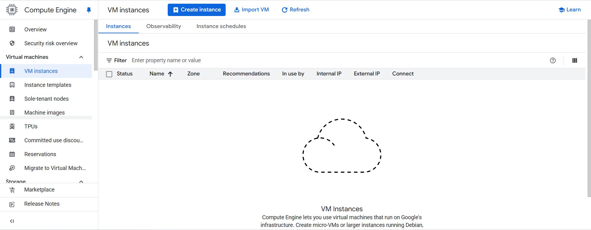
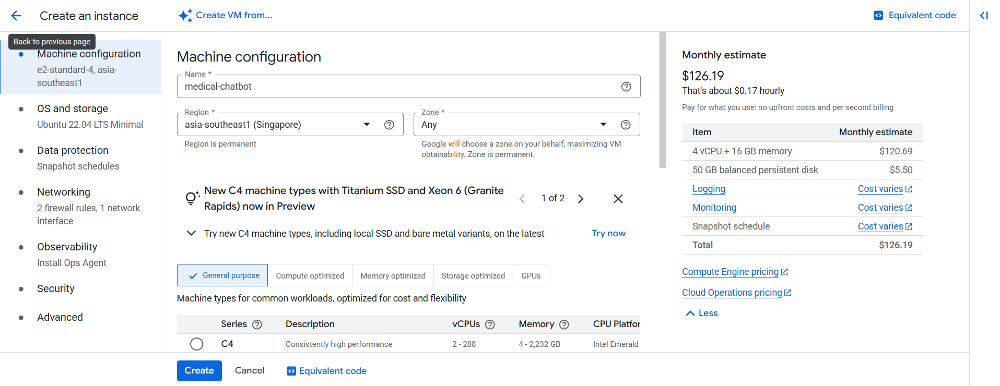
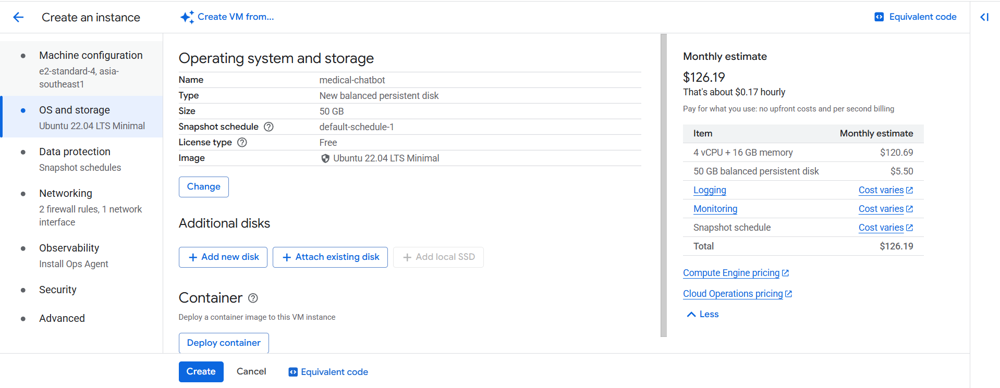
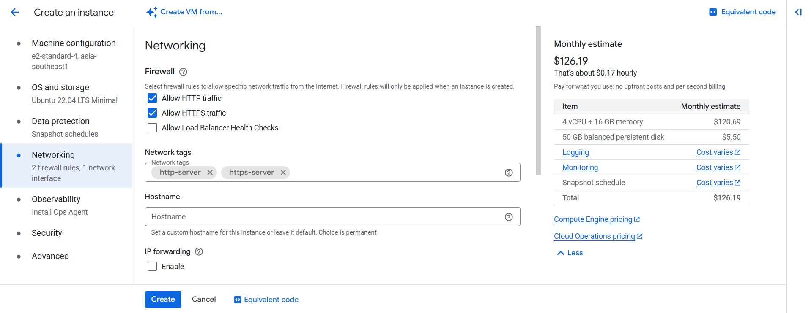
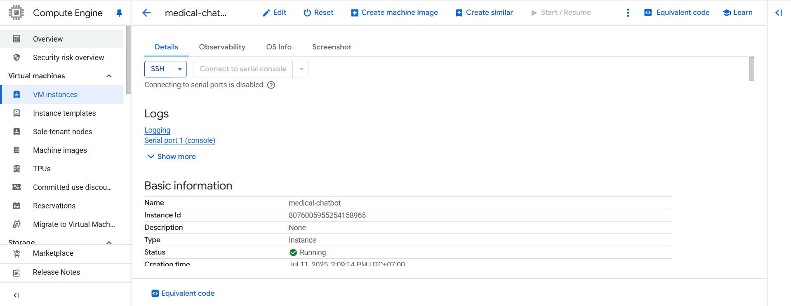
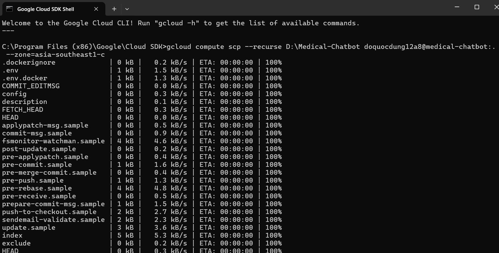

First, you need to create a Google Cloud VM instance by following these steps:
1. Go to the [Google Cloud Console](https://console.cloud.google.com/).
2. Create a new project or select an existing one.
3. Navigate to the "Compute Engine" section and create a new VM instance.
 
 




4. Download the SDK and install it on your local machine.
5. Open a terminal and run this command to copy all files to the VM instance

6. After copying the files, SSH into the VM instance and run the following command to start the Docker containers:
```bash
docker-compose up --build
```
Once running, you can access the services 