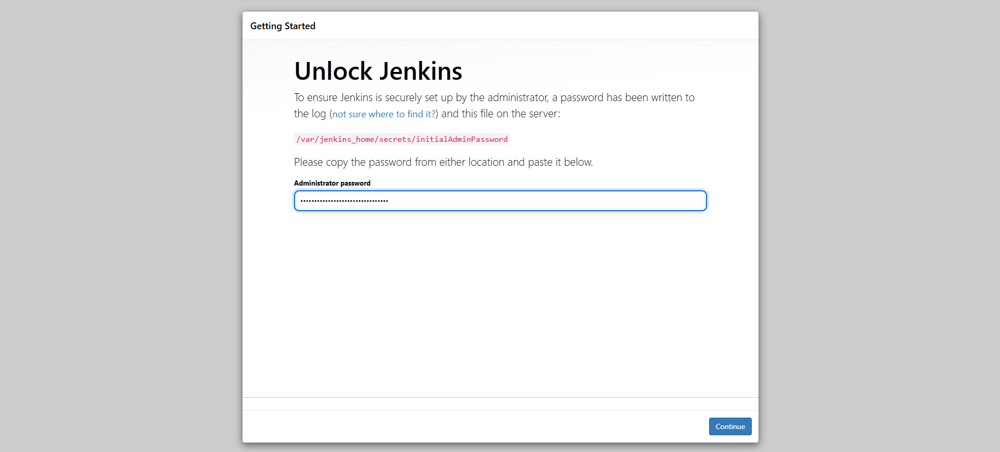
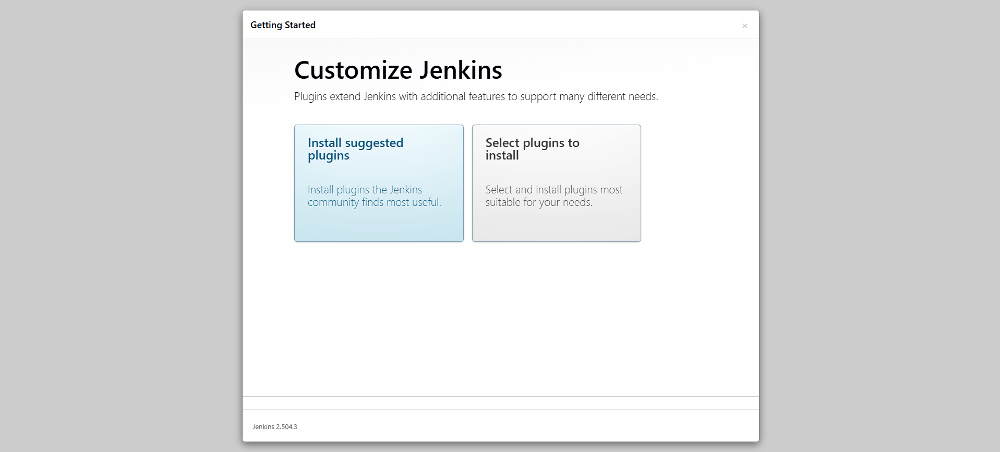
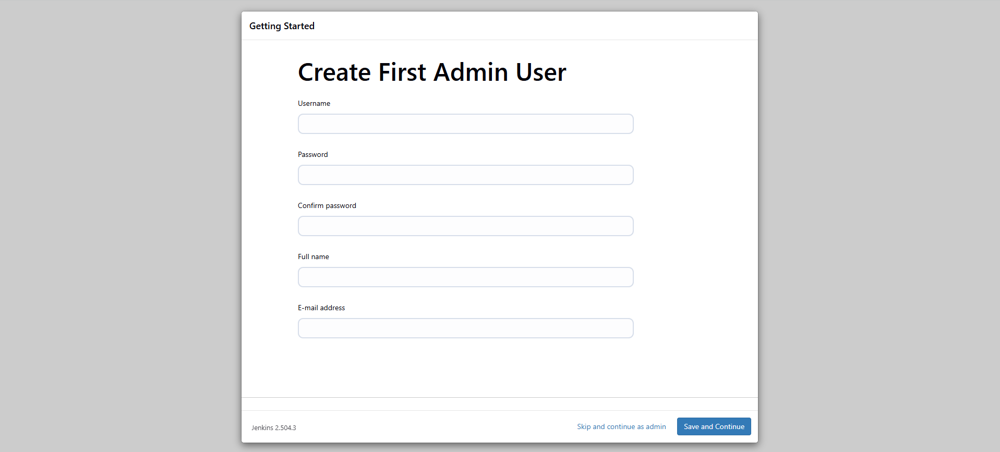
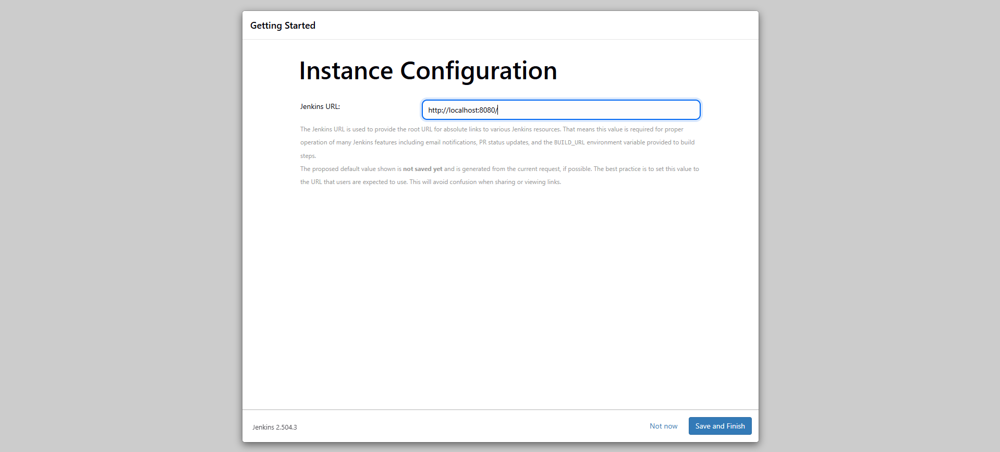
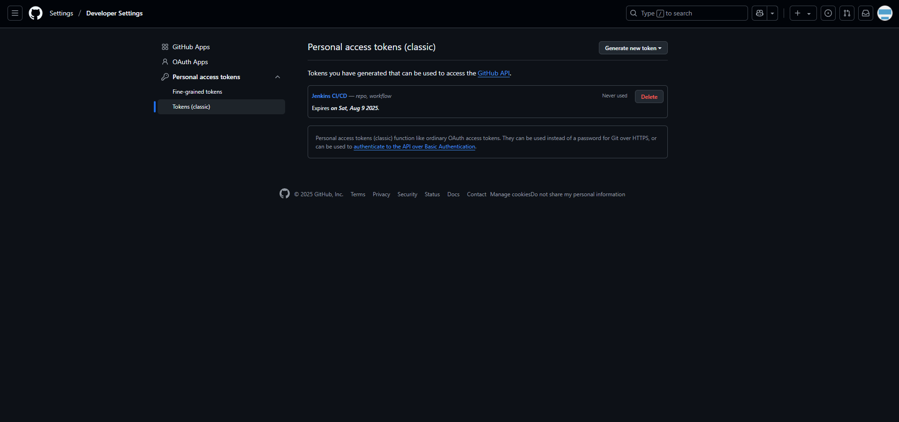
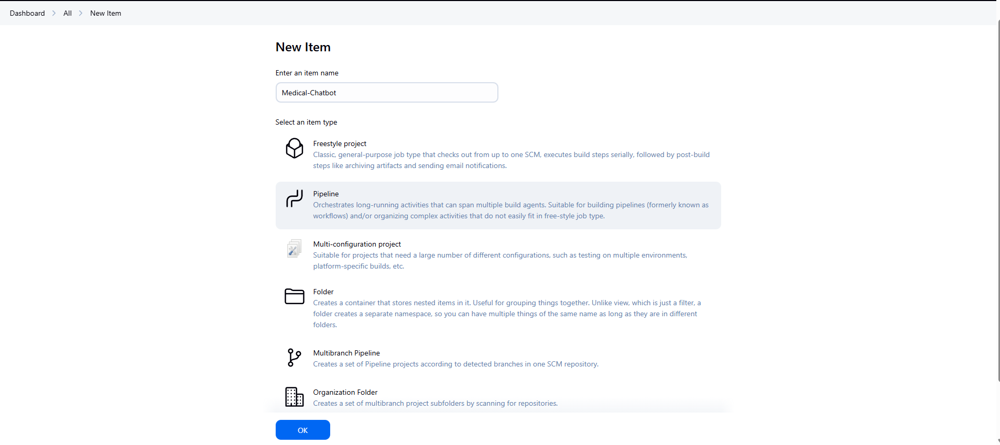
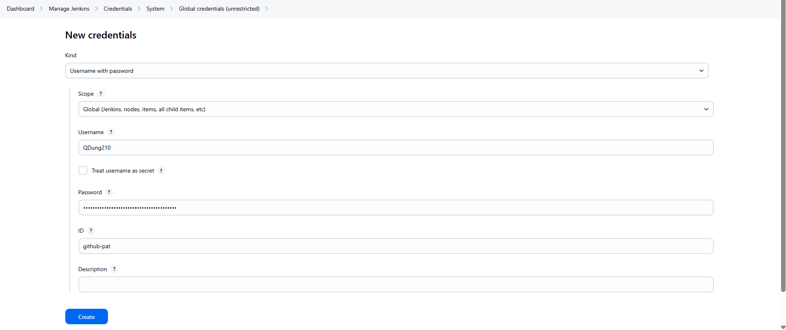
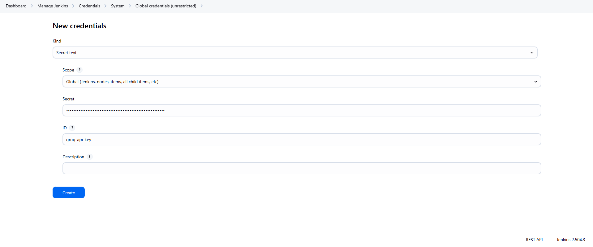
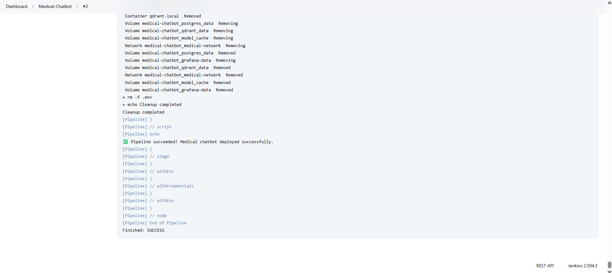

# CI/CD for Building and Testing with Jenkins

## 1. Build Jenkins container
Navigating to the `jenkins` directory (assuming we are at the root `tiny-llm-agent/`):
```bash
cd jenkins
```

Using docker compose to build and run the Jenkins container
```bash
docker-compose -f docker-compose.yml up --build
```  
---

## 2. Configurations
### Login
- Access to `http://localhost:8080/`.  

- In the first log in, use the provided password from the logs in the terminal.   Click "Continue".


### Installing plugins
- Select "Install suggested pluglins".


- Wating ...  
- **Note**: if any failures happen, just click retry to install the plugins. This happens sometimes due to network issues.

### Create user name and password
- Create user name and password.
  

- Use default port (http://localhost:8080).  
  

- Once completed, the main dashboard appears.  

---

## 3. Setting CI/CD pipeline  

### Set up credentials
- To allow Jenkins having access to GitHub project, go to GitHub and generate a personal access token (see image below).  
  

- Remenber to save the token in to a local file.

### Create a new item
- Comeback to Jenkins dashboard, click "New item" on the left corner of the dashboard to create a new CI/CD pipeline for the chat LLM project. 

- Select "Pipeline" then click OK.  


### Configure item

- Select `GitHub project` and enter the project's GitHub link: https://github.com/QDung210/Medical-Chatbot  

- Select `Pipeline script from SCM` -> `SCM: Git` -> `Repository URL: https://github.com/QDung210/Medical-Chatbot`.

- To add `Credentials`, select `Add` (below `Credentials`), and click `Jenkins`.  

- See Jenkins Credentials Provider configuration in image below. 
**Note** that the ID has to be set to `github-pat` so that cretantials match the configuration in [Jenkinsfile](Jenkinsfile).  
  

- Username: `QDung210`   

- Password is the GitHub personal access token from the eariler step.

- Click `Add` to complete, then get back to the Configure window and select `github-pat` credentials.  

- In `Branches to build`, select `*/main` instead of `*/master`.

- In `Script Path`, select `Jenkinsfile`.   

- Click `Save`.
- Go back to the credentials page and create a new credential for GROQ API key.
  
- Select `Secret text` and enter your GROQ API key.
- Set the ID to `groq-api-key` so that it matches the configuration in [Jenkinsfile](Jenkinsfile).
- Click `Create`.
- Go back to the pipeline and click `Build Now` on the left panel. This will automatically pull project from GitHub, run backend service


---

## 4. Clean up
To stop the container:
```bash
docker-compose down
```